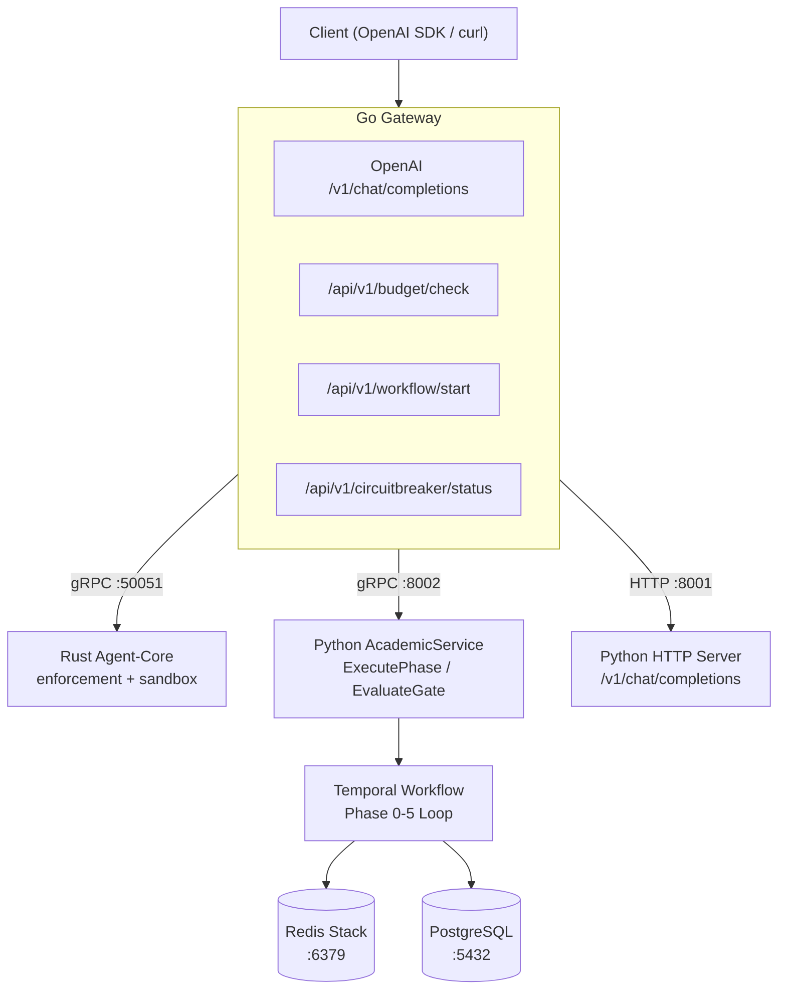
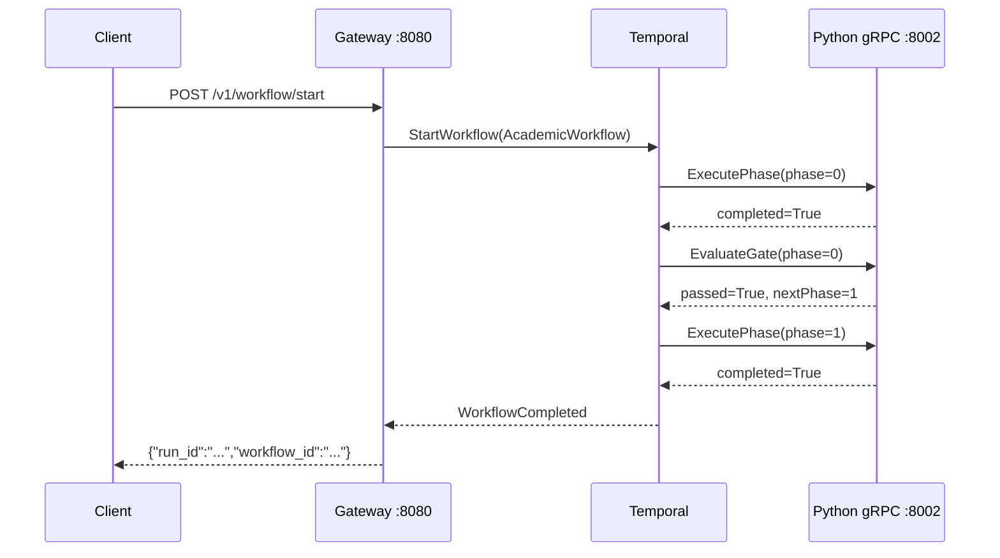
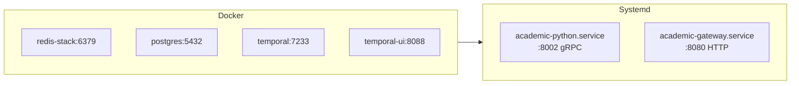

# shannon-academic

> Academic research pipeline — Go Gateway + Rust enforcement + Python LLM service + Temporal orchestration.

[](https://github.com/ITUSERMEM/shannon-academic/actions/workflows/ci.yml)

## Architecture

### Three-Layer Pipeline



### Phase Execution Flow



### Deployment



## Quick Start

### Docker Compose (recommended)

```bash
git clone https://github.com/ITUSERMEM/shannon-academic.git
cd shannon-academic
docker compose -f deploy/academic/docker-compose.yml up -d
curl http://localhost:8080/v1/health
open http://localhost:8080/docs
```

### systemd (local dev)

```bash
sudo cp deploy/academic/*.service /etc/systemd/system/
sudo systemctl daemon-reload
sudo systemctl start academic-python
sudo systemctl start academic-gateway
journalctl -u academic-gateway -f
```

### OpenAI-Compatible API

```python
import openai
client = openai.OpenAI(base_url="http://localhost:8080/v1", api_key="dev")
resp = client.chat.completions.create(
    model="academic",
    messages=[{"role": "user", "content": "Fault diagnosis with deep learning"}]
)
print(resp.choices[0].message.content)
# → "Pipeline started. Session: abc123, Phases: Phase 0 → Phase 1 → ..."
```

## Architecture

| Layer | Language | Port | Role |
|-------|----------|------|------|
| **Gateway** | Go | `:8080` | OpenAI API, budget, circuit breaker, Temporal |
| **Agent-Core** | Rust | `:50051` | Rate limit, sandbox, entropy monitor |
| **AcademicService** | Python | `:8002` gRPC, `:8001` HTTP | Phase execution, gate evaluation, events |
| **Orchestration** | Temporal | `:7233` | Workflow state machine, retry, replay |

## API Endpoints

| Method | Path | Description |
|--------|------|-------------|
| GET | `/v1/health` | Health check |
| GET | `/v1/models` | List models |
| POST | `/v1/chat/completions` | OpenAI-compatible |
| POST | `/api/v1/workflow/start` | Start pipeline |
| POST | `/api/v1/budget/check` | Budget check |
| GET | `/api/v1/circuitbreaker/status` | Circuit breaker |
| GET | `/api/v1/degradation/level` | Degradation status |

Full API docs: [http://localhost:8080/docs](http://localhost:8080/docs)

## Project Structure

```
shannon-academic/
├── go/orchestrator/         # Go Gateway + Temporal workflow
├── rust/agent-core/         # Rust enforcement + sandbox
├── python/academic-service/ # Python gRPC + HTTP server
├── protos/                  # gRPC protocol buffers
├── config/                  # Model registry, rate limits
├── deploy/                  # Docker, systemd, env
├── api/                     # OpenAPI specification
├── migrations/              # PostgreSQL schema
└── docs/                    # (coming soon)
```

## License

Apache 2.0
